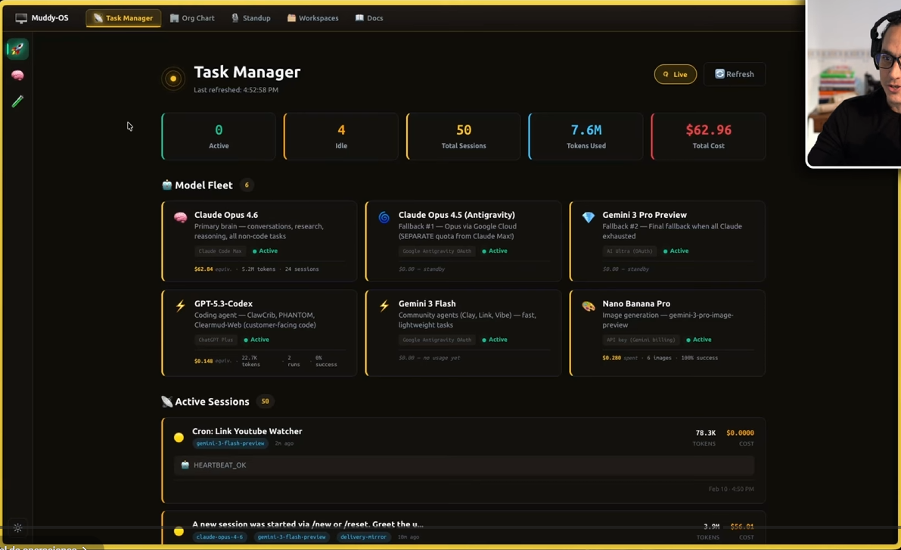
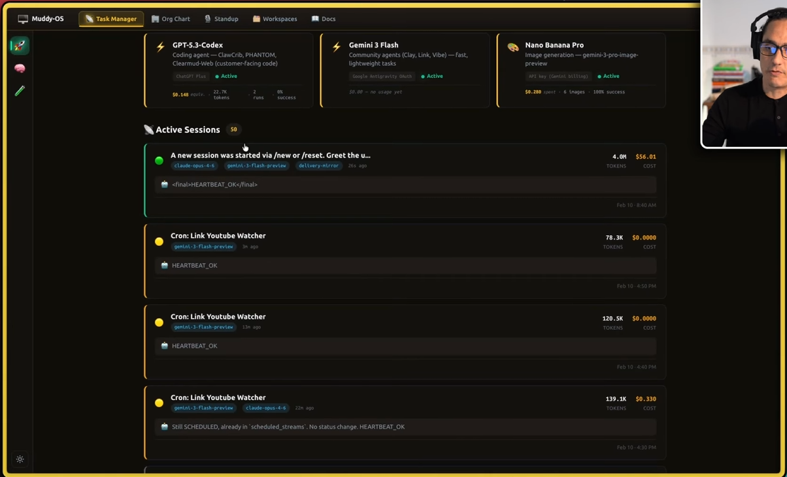
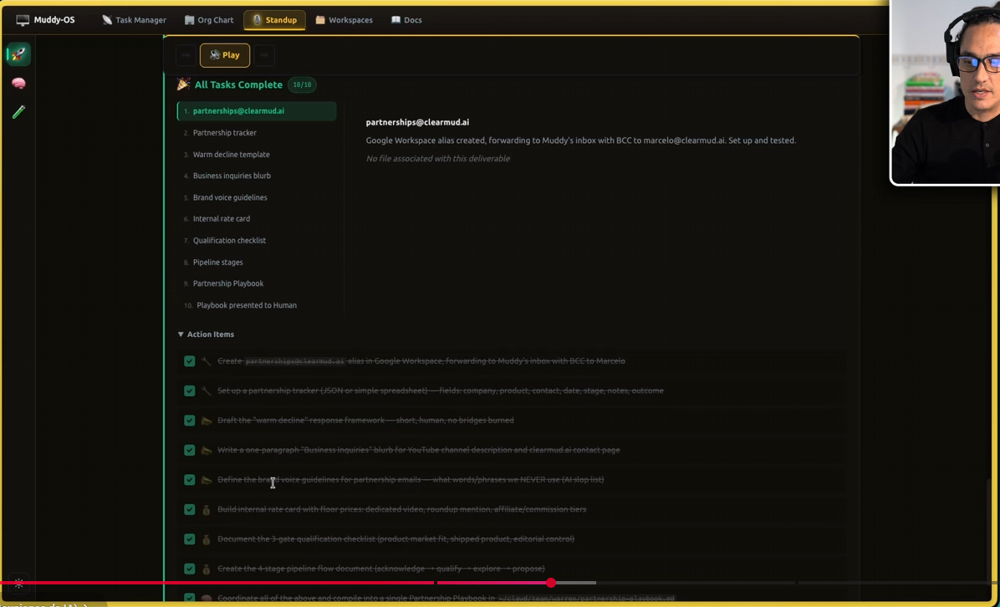
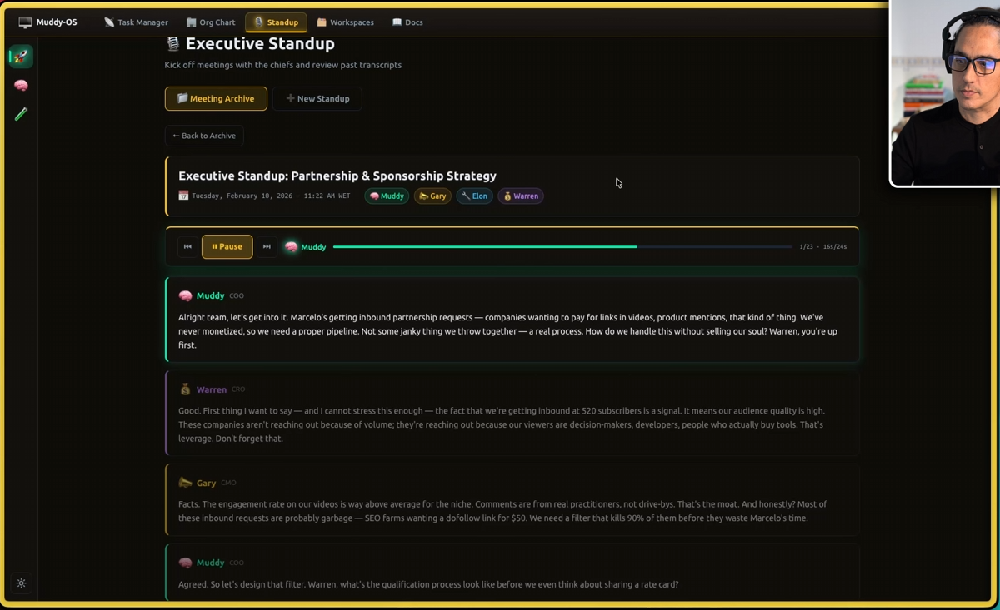

# Multi-Agents Dashboard

Mission-control style frontend for managing an AI agent team inspired by the reference video and screenshots.

This repo is the UI prototype layer for a dark command-center dashboard with five main surfaces:

- `Task Manager`
- `Org Chart`
- `Standup`
- `Workspace`
- `Docs`

It is built with `React + TypeScript + Vite` and focuses on the operator experience: seeing the fleet, reviewing standups, browsing agent workspaces, and navigating living documentation from one place.

## Screenshots

<p align="center">
  
  
</p>

<p align="center">
  
  
</p>

## What is in this repo

This repository currently contains the frontend dashboard experience, including:

- A dark mission-control shell with sidebar navigation and top tabs
- A `Task Manager` view with KPI cards, model fleet, active sessions, cron monitor, and overnight logs
- An `Org Chart` view for chiefs, departments, agents, models, and market filters
- A `Standup` view with archive mode, meeting detail, transcript playback UI, and deliverable/task panels
- A `Workspace` explorer for agent memory files like `SOUL.md`, `IDENTITY.md`, `USER.md`, `TOOLS.md`, `AGENTS.md`, and `MEMORY.md`
- A `Docs` section that explains the architecture and operating model

## What each section does

### Task Manager

The Task Manager is the main operating screen. It shows:

- Top-level metrics such as active agents, idle agents, tokens used, and total cost
- Model fleet cards for the reasoning stack
- Active sessions with recent logs, tokens, and spend
- Cron monitor jobs for community, research, and ops automations
- Overnight log items summarizing what agents built or improved

This is the best place to start when you want a quick snapshot of the whole system.

### Org Chart

The Org Chart visualizes the agent team structure:

- Chiefs by function like sales, dev, customer success, marketing, and finance
- Each department’s supporting agents
- Model assignments
- Market filters for `MX`, `USA`, or all markets
- Expand/collapse controls for deeper inspection

This view helps explain how the team is organized and what each lane owns.

### Standup

The Standup screen is designed to simulate executive briefings between agent chiefs.

It includes:

- Meeting archive cards
- Detailed transcript view
- Playback controls
- Task checklist / action items
- Deliverable detail panels

In this frontend version, playback is powered by the browser Speech Synthesis API when available, which makes the demo feel closer to a real multi-agent conversation review flow.

### Workspace

The Workspace tab acts like an internal knowledge and memory browser for each agent/workspace.

It lets you navigate:

- Different workspaces
- Key markdown files
- A document-style content pane for reading agent identity and operating instructions

This area is useful for showing how agent memory and internal docs might be surfaced in the dashboard.

### Docs

The Docs section is the living documentation surface.

It explains:

- What the dashboard is
- The broader architecture
- Agent framework concepts
- Memory system ideas
- Deployment assumptions

## Tech stack

- `React 19`
- `TypeScript`
- `Vite`
- `Tailwind CSS`
- `lucide-react`
- `motion`

The `package.json` also includes `express`, `dotenv`, `better-sqlite3`, and `@google/genai`, which suggests the project is prepared to evolve into a fuller app with server-side integrations.

## How to run locally

### Prerequisites

- `Node.js 18+` recommended

### Install dependencies

```bash
npm install
```

### Configure environment variables

This repo ships with a minimal `.env.example` oriented around AI Studio / Gemini:

```bash
cp .env.example .env.local
```

Then set:

- `GEMINI_API_KEY`
- `APP_URL`

If you are only testing the UI and not wiring AI features yet, the dashboard layout itself can still be explored locally after install.

### Start development server

```bash
npm run dev
```

By default Vite runs on:

```text
http://localhost:3000
```

## Build for production

```bash
npm run build
```

Preview the production build locally:

```bash
npm run preview
```

## Project structure

```text
src/
  App.tsx
  main.tsx
  index.css
  components/
    Sidebar.tsx
    TopNav.tsx
    TaskManager.tsx
    OrgChart.tsx
    Standup.tsx
    Workspace.tsx
    Docs.tsx
```

## How it works

At the moment, the dashboard is mostly a polished frontend prototype with curated mock data that represents how a real agent mission control would behave.

That means:

- The views are already designed and navigable
- The standup interactions and archive flow are present in the UI
- The workspace and docs concepts are represented visually
- The task manager demonstrates the operating model and visual hierarchy

The next step, if you want to keep evolving this repo, would be wiring these views to real APIs or a backend mission runner so the dashboard becomes live instead of demo-driven.

## Intended use

This repo is ideal if you want to:

- Demo the concept of a multi-agent mission control dashboard
- Use the UI as a starting point for a real OpenClaw or custom agent backend
- Recreate the command-center look and feel from the reference material
- Build a founder/operator cockpit for AI teams

## Notes

- This repo is the frontend prototype version of the dashboard concept.
- The more complete full-stack implementation can live in a separate production repo if you connect it to auth, SQLite, cron jobs, TTS, and real OpenClaw workspace state.
- The screenshots included here come from the reference captures you shared and are now embedded directly into the repo for GitHub presentation.
